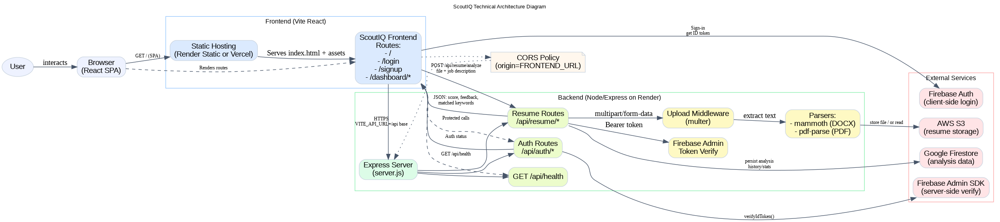

# 🎯 ScoutIQ - AI-Powered Resume Analysis Platform

<div align="center">
  
  <br>
  
  
  [](https://reactjs.org/)
  [](https://vitejs.dev/)
  [](https://tailwindcss.com/)
  [](https://firebase.google.com/)
  [](LICENSE)
  
  **Transform your resume analysis with AI-powered insights and intelligent job matching**
  
  [Live Demo](https://scout-iq-gray.vercel.app/) • [Documentation](#documentation) • [Features](#-features)
</div>

---

<br>

## 🚀 Overview

ScoutIQ is a cutting-edge web application that leverages artificial intelligence to provide comprehensive resume analysis and job matching capabilities. Built with modern React technologies, it offers an intuitive interface for users to upload resumes, receive detailed analysis, and get personalized job recommendations.

### ✨ Key Highlights

- 🤖 **AI-Powered Analysis**: Advanced machine learning algorithms for resume evaluation
- 📊 **Real-time Scoring**: Instant feedback with detailed breakdowns
- 🎯 **Smart Job Matching**: Intelligent comparison against job descriptions
- 📱 **Responsive Design**: Seamless experience across all devices
- 🔐 **Secure Authentication**: Firebase-powered user management
- ⚡ **Lightning Fast**: Built with Vite for optimal performance

---

## 🎨 Features

### 📋 Core Functionality

| Feature | Description | Status |
|---------|-------------|--------|
| **Resume Upload** | Support for DOCX and TXT files with drag-and-drop | ✅ |
| **AI Analysis** | Comprehensive resume evaluation with scoring | ✅ |
| **Job Matching** | Compare resumes against job descriptions | ✅ |
| **History Tracking** | Complete analysis history with detailed results | ✅ |
| **User Authentication** | Secure Firebase-based login/signup | ✅ |
| **Real-time Feedback** | Instant scores and improvement tips | ✅ |

### 🎯 Advanced Features

- **Multi-format Support**: DOCX, TXT file formats
- **Progress Tracking**: Real-time upload and analysis progress
- **Export Capabilities**: Download analysis reports
- **Dark Mode**: Built-in theme switching
- **Toast Notifications**: User-friendly feedback system
- **Responsive UI**: Optimized for desktop, tablet, and mobile

---

## 🛠️ Technology Stack

<div align="center">

| Category | Technology | Version | Purpose |
|----------|------------|---------|---------|
| **Frontend** | React | 19.1.1 | UI Framework |
| **Build Tool** | Vite | 7.1.2 | Development & Build |
| **Styling** | Tailwind CSS | 4.1.12 | Utility-first CSS |
| **Components** | shadcn/ui | Latest | UI Component Library |
| **Icons** | Lucide React | 0.541.0 | Icon Library |
| **Routing** | React Router | 7.8.2 | Client-side Routing |
| **HTTP Client** | Axios | 1.11.0 | API Communication |
| **Authentication** | Firebase | 12.1.0 | User Management |
| **Notifications** | React Toastify | 11.0.5 | Toast Messages |

</div>

---

## 📦 Installation & Setup

### Prerequisites

- Node.js (v18 or higher)
- npm or yarn package manager
- Firebase project setup

### Quick Start

1. **Clone the repository**
   ```bash
   git clone <repository-url>
   cd ScoutIQ/frontend
   ```

2. **Install dependencies**
   ```bash
   npm install
   ```

3. **Environment Configuration**
   Create a `.env` file in the frontend directory:
   ```env
   VITE_API_URL=http://localhost:3000/api
   VITE_FIREBASE_API_KEY=your_firebase_api_key
   VITE_FIREBASE_AUTH_DOMAIN=your_firebase_auth_domain
   VITE_FIREBASE_PROJECT_ID=your_firebase_project_id
   VITE_FIREBASE_STORAGE_BUCKET=your_firebase_storage_bucket
   VITE_FIREBASE_MESSAGING_SENDER_ID=your_messaging_sender_id
   VITE_FIREBASE_APP_ID=your_firebase_app_id
   ```

4. **Start development server**
   ```bash
   npm run dev
   ```

5. **Open your browser**
   Navigate to `http://localhost:3000`

### Available Scripts

```bash
npm run dev          # Start development server
npm run build        # Build for production
npm run preview      # Preview production build
npm run lint         # Run ESLint
```

---

## 🏗️ Project Architecture

```
ScoutIQ/
├── 📁 frontend/              # React application
│   ├── 📁 src/
│   │   ├── 📁 components/
│   │   │   ├── 📁 ui/        # shadcn/ui components
│   │   │   │   ├── button.jsx
│   │   │   │   ├── card.jsx
│   │   │   │   ├── input.jsx
│   │   │   │   ├── label.jsx
│   │   │   │   ├── textarea.jsx
│   │   │   │   ├── badge.jsx
│   │   │   │   ├── progress.jsx
│   │   │   │   └── tabs.jsx
│   │   │   └── 📁 ...        # Custom components
│   │   ├── 📁 pages/
│   │   │   ├── DashboardPage.jsx
│   │   │   ├── LandingPage.jsx
│   │   │   ├── LoginPage.jsx
│   │   │   ├── SignUpPage.jsx
│   │   │   └── HomePage.jsx
│   │   ├── 📁 services/
│   │   │   └── api.js
│   │   ├── 📁 lib/
│   │   │   └── utils.js
│   │   ├── 📁 assets/
│   │   │   └── react.svg
│   │   ├── App.jsx
│   │   ├── main.jsx
│   │   ├── index.css
│   │   └── firebase.js
│   ├── 📁 public/
│   ├── package.json
│   ├── tailwind.config.js
│   ├── vite.config.js
│   ├── vercel.json
│   └── README.md
├── 📁 backend/               # Backend API (if applicable)
├── logo.png                  # Project logo
├── icon.png                  # Project icon
└── README.md                 # This file
```

---

## 🎨 Design System

### Color Palette

<div align="center">

| Color | Hex | Usage |
|-------|-----|-------|
| Primary Blue | `#3B82F6` | Main brand, buttons, links |
| Secondary Gray | `#6B7280` | Supporting text, borders |
| Success Green | `#10B981` | Success states, positive actions |
| Warning Yellow | `#F59E0B` | Warning states, caution |
| Error Red | `#EF4444` | Error states, destructive actions |
| Background | `#FFFFFF` / `#1F2937` | Light/dark mode backgrounds |

</div>

### Component Library

Built with **shadcn/ui** for consistent, accessible, and beautiful components:

- **Cards**: Content containers with shadows and borders
- **Buttons**: Multiple variants (primary, secondary, outline, ghost)
- **Inputs**: Form controls with focus states and validation
- **Badges**: Status indicators and labels
- **Progress**: Loading and progress indicators
- **Tabs**: Content organization and navigation

---

## 📱 Responsive Design

The application is fully responsive with optimized layouts for:

- **📱 Mobile**: < 640px - Optimized touch interface
- **📱 Tablet**: 640px - 1024px - Balanced layout
- **💻 Desktop**: > 1024px - Full-featured interface

### Breakpoint Strategy

```css
/* Mobile First Approach */
.container {
  padding: 1rem;           /* Mobile */
}

@media (min-width: 640px) {
  .container {
    padding: 2rem;         /* Tablet */
  }
}

@media (min-width: 1024px) {
  .container {
    padding: 3rem;         /* Desktop */
  }
}
```

---

## 🔐 Authentication & Security

### Firebase Integration

- **Email/Password**: Traditional authentication
- **Token Management**: Automatic token refresh
- **Secure Logout**: Proper session cleanup
- **Error Handling**: Comprehensive error management

### Security Features

- Environment variable protection
- API key management
- CORS configuration
- Input validation and sanitization

---

## 📊 API Integration

### Service Layer Architecture

```javascript
// Centralized API service
const api = {
  resume: {
    analyze: (file) => post('/resume/analyze', file),
    history: () => get('/resume/history'),
    getById: (id) => get(`/resume/${id}`)
  },
  auth: {
    verify: () => get('/auth/verify')
  }
};
```

### Available Endpoints

| Method | Endpoint | Description |
|--------|----------|-------------|
| `POST` | `/api/resume/analyze` | Upload and analyze resume |
| `GET` | `/api/resume/history` | Get analysis history |
| `GET` | `/api/resume/:id` | Get specific analysis |
| `GET` | `/api/auth/verify` | Verify authentication |

---

## 🚀 Deployment

### Vercel Deployment

The project includes `vercel.json` configuration for seamless deployment:

```json
{
  "rewrites": [
    {
      "source": "/(.*)",
      "destination": "/index.html"
    }
  ],
  "buildCommand": "npm run build",
  "outputDirectory": "dist",
  "framework": "vite"
}
```

### Build Process

1. **Development Build**
   ```bash
   npm run build
   ```

2. **Production Preview**
   ```bash
   npm run preview
   ```

3. **Deploy to Vercel**
   ```bash
   vercel --prod
   ```

### Environment Variables for Production

```env
VITE_API_URL=https://your-api-domain.com/api
VITE_FIREBASE_API_KEY=your_production_firebase_key
VITE_FIREBASE_AUTH_DOMAIN=your_production_domain
VITE_FIREBASE_PROJECT_ID=your_production_project_id
VITE_FIREBASE_STORAGE_BUCKET=your_production_storage_bucket
VITE_FIREBASE_MESSAGING_SENDER_ID=your_production_sender_id
VITE_FIREBASE_APP_ID=your_production_app_id
```

---

## 🧪 Development Guidelines

### Code Style

- **ESLint**: Configured for React best practices
- **Prettier**: Recommended for consistent formatting
- **Component Architecture**: Modular, reusable components
- **Naming Conventions**: Consistent file and variable naming

### Best Practices

- Use functional components with hooks
- Implement proper error boundaries
- Follow accessibility guidelines
- Write clean, documented code
- Test components thoroughly

### File Structure Conventions

```
components/
├── ComponentName/
│   ├── ComponentName.jsx
│   ├── ComponentName.module.css
│   └── index.js
```

---

## 🤝 Contributing

We welcome contributions! Please follow these steps:

1. **Fork** the repository
2. **Create** a feature branch (`git checkout -b feature/amazing-feature`)
3. **Commit** your changes (`git commit -m 'Add amazing feature'`)
4. **Push** to the branch (`git push origin feature/amazing-feature`)
5. **Open** a Pull Request

### Contribution Guidelines

- Follow the existing code style
- Add tests for new features
- Update documentation as needed
- Ensure all tests pass
- Provide clear commit messages

---

## 📄 License

This project is licensed under the **MIT License** - see the [LICENSE](LICENSE) file for details.

---

## 🆘 Support & Documentation

### Getting Help

- 📖 **Documentation**: Check this README and inline code comments
- 🐛 **Issues**: Report bugs via GitHub Issues
- 💬 **Discussions**: Join our community discussions
- 📧 **Email**: Contact the development team

### Useful Links

- [Live Application](https://scout-iq-gray.vercel.app/)
- [API Documentation](#api-integration)
- [Component Library](https://ui.shadcn.com/)
- [Tailwind CSS Docs](https://tailwindcss.com/docs)
- [React Documentation](https://reactjs.org/docs/)

---

<div align="center">

**Built with ❤️ using modern web technologies**

[](https://reactjs.org/)
[](https://vitejs.dev/)
[](https://tailwindcss.com/)

*ScoutIQ - Empowering your career with AI-driven insights*

</div>
